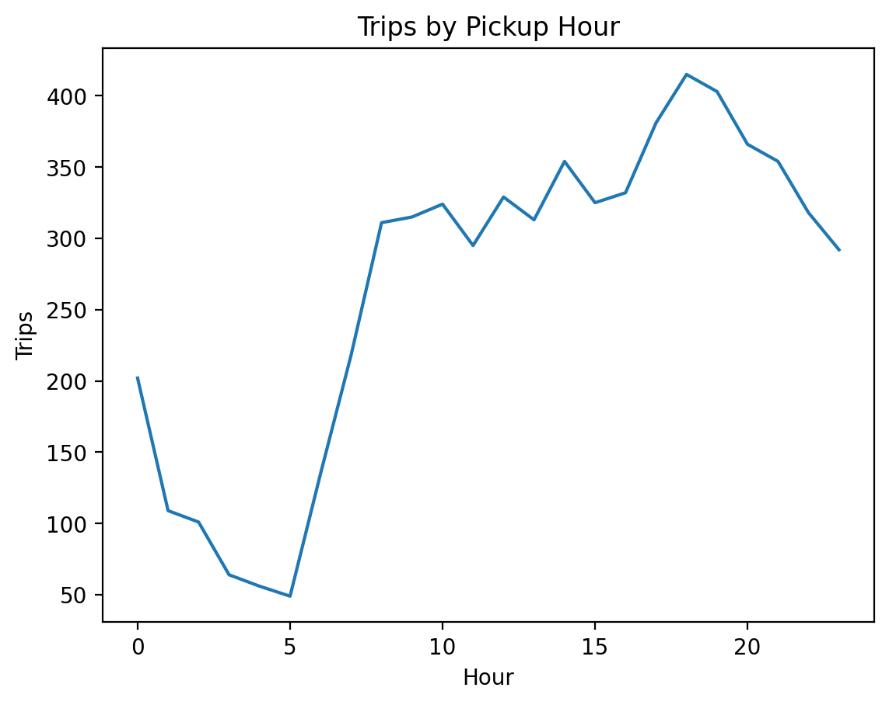

[](https://github.com/harshitmaann/cloud-data-pipeline-taxi-analytics/actions/workflows/ci.yml)

# Cloud Data Pipeline + Analytics — Taxi Trips

A reproducible, end-to-end data pipeline that **extracts** a public taxi trips dataset, **transforms** it into analytics-ready **Parquet**, runs **SQL analytics in DuckDB**, and generates **reports + charts**. Built with a clean project structure and **CI on every push** to keep the pipeline reliable.

## Preview


## What this pipeline does
- **Extract**: downloads raw taxi data to `data/raw/`
- **Transform**: cleans + enriches data and writes curated Parquet to `data/processed/`
- **Analyze**: loads Parquet into DuckDB, computes KPIs, and exports outputs to `reports/`

## Outputs (generated)
- `reports/kpis.csv` — high-level metrics (counts, averages, etc.)
- `reports/avg_fare_by_weekday.csv` — weekday fare trends
- `reports/figures/trips_by_hour.png` — trips by pickup hour chart (generated)
- `assets/trips_by_hour.png` — committed preview image used in this README

> Note: `data/` and `reports/` outputs are **gitignored** to keep the repo clean and reproducible. The `assets/` folder is committed for README visuals.

## Tech stack
**Python**, **Pandas**, **DuckDB**, **Parquet (PyArrow)**, **Matplotlib**, **Pytest**, **GitHub Actions**

## Project structure
```
cloud-data-pipeline-taxi-analytics/
├─ src/
│  ├─ pipeline/          # extract + transform
│  └─ analysis/          # duckdb analytics + charts
├─ data/
│  ├─ raw/               # downloaded dataset (gitignored)
│  └─ processed/         # curated parquet (gitignored)
├─ reports/
│  └─ figures/           # charts (gitignored)
├─ assets/               # committed preview images used in README
├─ tests/                # pipeline tests
└─ .github/workflows/    # CI workflow
```

## Run locally
```bash
python3 -m venv .venv
source .venv/bin/activate
pip install -r requirements.txt
make run
```

## Run tests
```bash
make test
```

## CI
GitHub Actions runs on every push:
- installs dependencies
- runs `make run`
- runs `make test`
